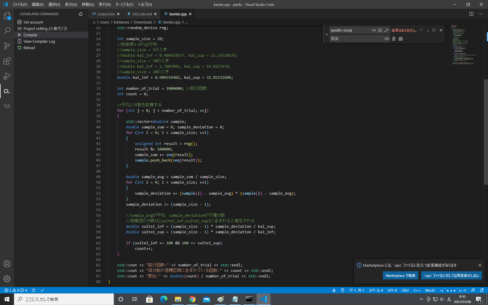

# VSCodeを布教する
こんにちは。ヒトデマンです。みなさんプログラミングはやったことはありますか？（唐突）特に理系では、プログラミングは今や必須のツールであるといえるでしょう。プログラミングをするのは壁が高そう。。。という人もいるかもしれません。VSCodeを使うと下のような環境を「「「**簡単に**」」」構築することができます。

そのほかにも
- 軽い・必要な容量が少ない
- 機能・拡張機能が充実している
- 使用している人数が多い

などのメリットが存在します。特に2番目は特筆すべきであり、この記事でもいろいろ語っていくつもりです。

### 軽い・必要な容量が少ない
　これは言うまでもないと思います。コードを書いていざそれを実行！というときに重くてPCがフリーズ＿＿＿とかしたらとても悲しいです。モチベめちゃくちゃ下がります。VSCodeはタブをたくさん開いてもそういうことがなく、サクサク動くのでとても快適です。

### 機能が充実している
「Ctrl+Shift+@」でコマンドラインを開いたり、「Ctrl+N」で新規ファイルを開いてくれるなど、ショートカットが充実しています。インテリセンスやユーザースニペットで使える補完機能も強力です。また、この記事はMarkdownで書いています。VSCodeはMarkdownをプレビューすることもできます。

これはVSCodeをインストールするだけで使える機能ですが、さらにVSCode最大の目玉でもあるといえる拡張機能があります。例えば、cppファイル(C++)を開くと、エディターがC++の拡張機能をいれるように勧めてくれ、入れると↑のようになります。

*拡張機能は画面の左側から見ることができる*

##### 拡張機能の紹介
- Japanese Language Pack for Visual Studio Code

VSCodeは本来英語ですが、この拡張機能を入れることで日本語にすることができます。

- Bracket Pair Colorizer

名前の通りです。ペアになっているカッコに色を付けてくれるのでカッコが足りないなどの単純なミスが一目でわかります。

- Git History

この拡張を入れると、Gitの機能がVSCodeから使えます。

*+を押してadd、☑を押してコミット、そしてプッシュ！*

- Kitty time

猫が現れます！かわいい！

- Cloud LaTeX

神。

(画像はCloud LaTeX公式サイトより)

もともとVSCodeにはLaTeX WorkshopというLaTeXをいじるための拡張機能があって、そちらはそちらで拡張機能が優秀でした（ボタン一つでコマンドが打てる）。しかし、PC自体にTeXを入れる必要があって渋く（TeXは容量を食うので）、しぶしぶCloud LaTeXを使っていました。それがこの拡張の登場で、設定ファイルを入れる必要はなく、VSCode一本でTeX打ちできるようになってすごく便利になっています。もちろんLaTeX Workshopの補完機能自体は使えます。また、構文チェックもしてくれたり、Ctrl+Sだけで自動でクラウドに同期→コンパイル→pdfファイルをローカルと同期までやってくれます。PDFファイルもVSCodeで開けるので、VSCodeだけで作業が完結します。

この状態からtexファイルを変更して保存すると次のようになります。

自動でtexファイルとクラウド上で同期してくれ、さらにpdfも吐き出してくれることがわかります。

***

いろいろな拡張を紹介しましたが、ここで紹介したのはほんの一部です。

### 使用している人数が多い

使用しているコミュニティが広いのでググると大体出てきます。まさに巨人の肩に乗っているという感じがします。

#　あとがき

TeXはカス。Markdownこそ至高。TeXファイルに変換するのをあきらめて画像で提出しました...(画像ファイルの扱いが本当に分からなかった...)
