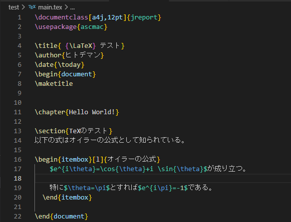

# VSCode を布教する

こんにちは。ヒトデマンです。みなさんプログラミングはやったことはありますか？（唐突）特に理系では、プログラミングは今や必須のツールであるといえるでしょう。プログラミングをするのは壁が高そう。。。という人もいるかもしれません。VSCode を使うと下のような環境を「「「**簡単に**」」」構築することができます。

そのほかにも

- 軽い・必要な容量が少ない
- 機能・拡張機能が充実している
- 使用している人数が多い

などのメリットが存在します。特に 2 番目は特筆すべきであり、この記事でもいろいろ語っていくつもりです。

### 軽い・必要な容量が少ない

これは言うまでもないと思います。コードを書いていざそれを実行！というときに重くて PC がフリーズ＿＿＿とかしたらとても悲しいです。モチベめちゃくちゃ下がります。VSCode はタブをたくさん開いてもそういうことがなく、サクサク動くのでとても快適です。

### 機能が充実している

「Ctrl+Shift+@」でコマンドラインを開いたり、「Ctrl+N」で新規ファイルを開いてくれるなど、ショートカットが充実しています。インテリセンスやユーザースニペットで使える補完機能も強力です。また、この記事は Markdown で書いています。VSCode は Markdown をプレビューすることもできます。

これは VSCode をインストールするだけで使える機能です。また、さらに、Git の機能が VSCode から使えます。

_+を押して add、☑ を押してコミット、そしてプッシュ！_

さらに VSCode 最大の目玉でもあるといえる拡張機能があります。例えば、cpp ファイル(C++)を開くと、エディターが C++の拡張機能をいれるように勧めてくれ、入れると ↑ のようになります。

_拡張機能は画面の左側から見ることができる_

##### 拡張機能の紹介

- Japanese Language Pack for Visual Studio Code

VSCode は本来英語ですが、この拡張機能を入れることで日本語にすることができます。

- Bracket Pair Colorizer

名前の通りです。ペアになっているカッコに色を付けてくれるのでカッコが足りないなどの単純なミスが一目でわかります。

- Prettier

コードを自動で整形してくれます。

- Kitty time

猫が現れます！かわいい！

- Cloud LaTeX

神。

(画像は Cloud LaTeX 公式サイトより)

もともと VSCode には LaTeX Workshop という LaTeX をいじるための拡張機能があって、そちらはそちらで拡張機能が優秀でした（ボタン一つでコマンドが打てる）。しかし、PC 自体に TeX を入れる必要があって渋く（TeX は容量を食うので）、しぶしぶ Cloud LaTeX を使っていました。それがこの拡張の登場で、設定ファイルを入れる必要はなく、VSCode 一本で TeX 打ちできるようになってすごく便利になっています。もちろん LaTeX Workshop の補完機能自体は使えます。また、構文チェックもしてくれたり、Ctrl+S だけで自動でクラウドに同期 → コンパイル →pdf ファイルをローカルと同期までやってくれます。PDF ファイルも VSCode で開けるので、VSCode だけで作業が完結します。

この状態から tex ファイルを変更して保存すると次のようになります。

自動で tex ファイルとクラウド上で同期してくれ、さらに pdf も吐き出してくれることがわかります。

---

いろいろな拡張を紹介しましたが、ここで紹介したのはほんの一部です。

### 使用している人数が多い

使用しているコミュニティが広いのでググると大体出てきます。まさに巨人の肩に乗っているという感じがします。

#　あとがき

TeX はカス。Markdown こそ至高。TeX ファイルに変換するのをあきらめて pdf で提出しました...(画像ファイルの扱いが本当に分からなかった...)
